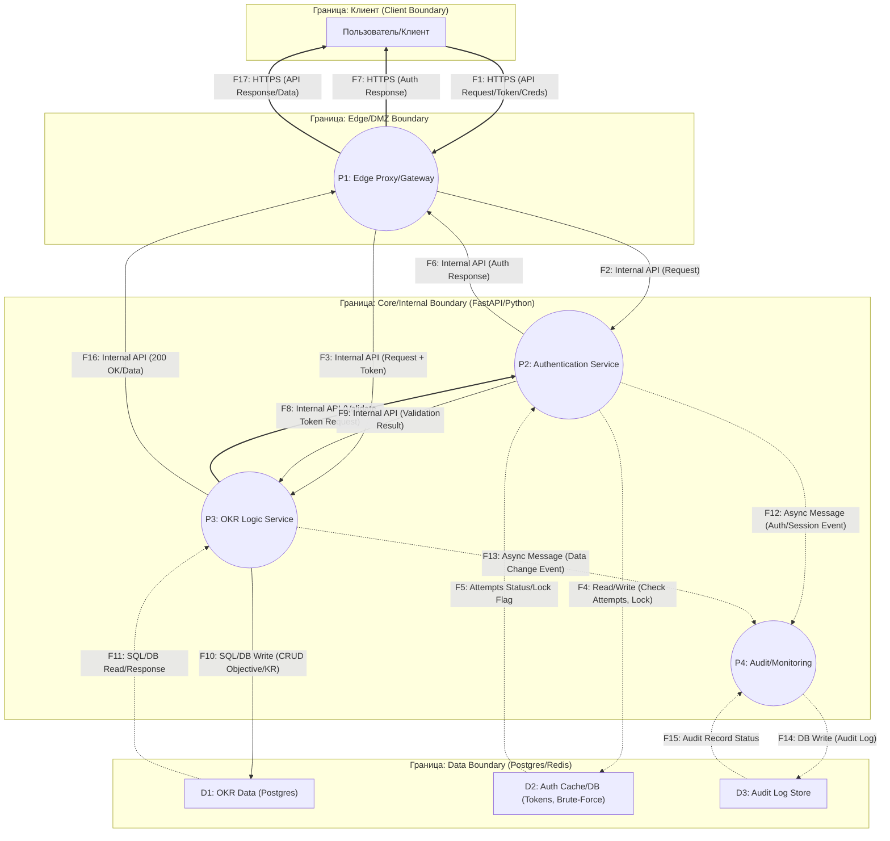

```mermaid
graph TD
    %% -----------------------------------------------------
    %% Границы Доверия (Trust Boundaries)
    
    subgraph Client ["Граница: Клиент (Client Boundary)"]
        E1["Пользователь/Клиент"]
    end
    
    subgraph Edge ["Граница: Edge/DMZ Boundary"]
        P1(("P1: Edge Proxy/Gateway"))
    end
    
    subgraph Core ["Граница: Core/Internal Boundary (FastAPI/Python)"]
        P2(("P2: Authentication Service"))
        P3(("P3: OKR Logic Service"))
        P4(("P4: Audit/Monitoring"))
    end
    
    subgraph Data ["Граница: Data Boundary (Postgres/Redis)"]
        D1["D1: OKR Data (Postgres)"]
        D2["D2: Auth Cache/DB (Tokens, Brute-Force)"]
        D3["D3: Audit Log Store"]
    end
    
    %% -----------------------------------------------------
    %% Основные Потоки (General Operation: Auth/CRUD)
    
    E1 -- "F1: HTTPS (API Request/Token/Creds)" --> P1
    P1 -- "F2: Internal API (Request)" --> P2
    P1 -- "F3: Internal API (Request + Token)" --> P3
    
    %% -----------------------------------------------------
    %% Flow: Аутентификация и защита от Brute-Force
    
    P2 -- "F4: Read/Write (Check Attempts, Lock)" --> D2
    D2 -- "F5: Attempts Status/Lock Flag" --> P2
    
    P2 -- "F6: Internal API (Auth Response)" --> P1
    P1 -- "F7: HTTPS (Auth Response)" --> E1
    
    %% -----------------------------------------------------
    %% Flow: Проверка токена и CRUD
    
    P3 -- "F8: Internal API (Validate Token Request)" --> P2
    P2 -- "F9: Internal API (Validation Result)" --> P3
    
    P3 -- "F10: SQL/DB Write (CRUD Objective/KR)" --> D1
    D1 -- "F11: SQL/DB Read/Response" --> P3
    
    %% -----------------------------------------------------
    %% Flow: Аудит
    
    P2 -- "F12: Async Message (Auth/Session Event)" --> P4
    P3 -- "F13: Async Message (Data Change Event)" --> P4
    
    P4 -- "F14: DB Write (Audit Log)" --> D3
    D3 -- "F15: Audit Record Status" --> P4
    
    %% -----------------------------------------------------
    %% Final Response
    
    P3 -- "F16: Internal API (200 OK/Data)" --> P1
    P1 -- "F17: HTTPS (API Response/Data)" --> E1
    
    
    %% -----------------------------------------------------
    %% Протоколы/Каналы (для STRIDE)
    
    classDef external stroke-dasharray: 5 5, stroke:#ff0000;
    classDef internal stroke-dasharray: 2 2, stroke:#0000ff;
    
    %% Теперь правильно: между инструкциями — пустая строка
    linkStyle 0,6,7,16 stroke:#333, stroke-width:2px;
    %% HTTPS (Client-Edge)
    
    linkStyle 1,2,5,8,9,15 stroke:#333, stroke-width:1px;
    %% Internal API (Edge-Core/Core-Core)
    
    linkStyle 3,4,10,11,12,13,14 stroke:#333, stroke-width:1px, stroke-dasharray: 2 2;
    %% DB/Async/Internal
```
